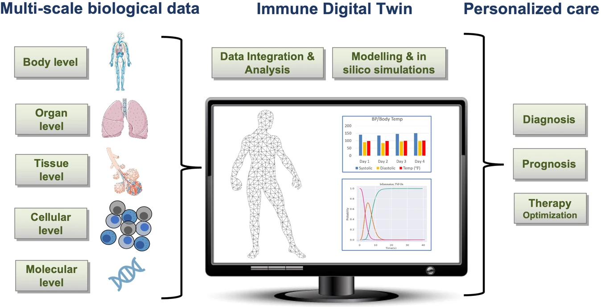
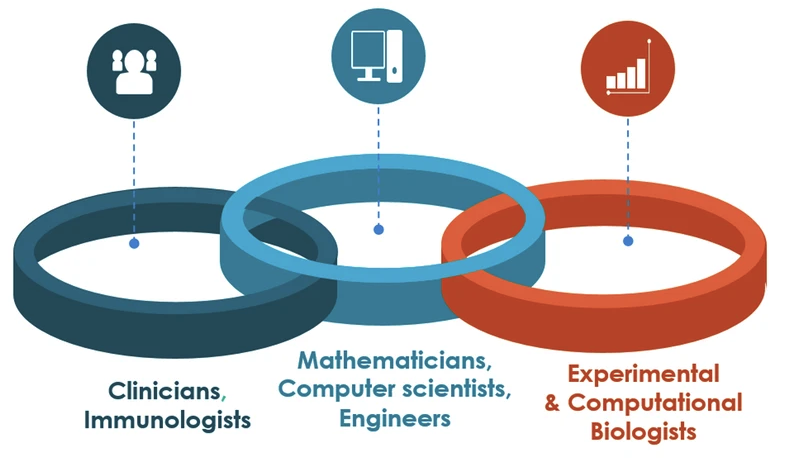

Welcome to the Building Immune Digital Twins (BIDT) initiative — a global, community-driven effort to develop computational replicas of the human immune system. Our goal is to advance our understanding and treatment of diseases by simulating immune responses tailored to individuals.

Whether you're a researcher, clinician, or data scientist, join us in shaping the future of personalized medicine.

<section class="flex-section">
  

  <h2>🔍 What are immune digital twins?</h2>
  

    <strong>Immune digital twins</strong> are dynamic computational models designed to simulate how an individual’s immune system responds to infections, therapies, and vaccines. By integrating biological knowledge, clinical data, and modeling techniques, we aim to support:
  

  <ul>
    <li>Personalized diagnostics</li>
    <li>Predictive medicine</li>
    <li>Targeted therapeutic development</li>
    <li>Systems-level understanding of immunity</li>
  </ul>
  

  

    <figure>
      
      <figcaption>Source: <a href="https://doi.org/10.1038/s41746-022-00610-z" target="_blank">10.1038/s41746-022-00610-z</a></figcaption>
    </figure>
  

</section>

<section class="flex-section">
  

    <h2>🚀 Our mission</h2>
    

      We are building an open, collaborative ecosystem for:
    

    <ul>
      <li>Curation of high-quality immunology data</li>
      <li>Development of reusable and interoperable models</li>
      <li>Best practices for constructing and validating digital twins</li>
      <li>Integration with platforms like the Virtual Human Twin</li>
    </ul>
    

      Learn more in our <a href="https://www.rd-alliance.org/wp-content/uploads/2024/03/Building-Immunge-Digital-Twins-WG_Case_Statement_Revised.pdf" target="_blank">RDA Working Group Case Statement ›</a>
    

  

  

    <figure>
      
      <figcaption>Source: <a href="https://doi.org/10.1038/s41540-024-00450-5" target="_blank">10.1038/s41540-024-00450-5</a></figcaption>
    </figure>
  

</section>

<h2>Contact us</h2>

[immunedigitaltwin@gmail.com](mailto:immunedigitaltwin@gmail.com)